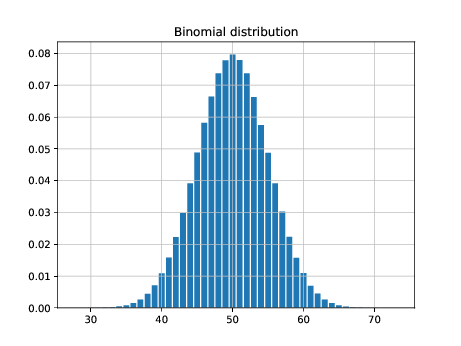

# Using a `Counter` in a parallel computation

This directory contains an example of using a `Counter` in
a parallel computation. In this example we generate
one million binomial random values according to the
binomial distribution `B(100,0.5)`. We divide up the work
using multiple processors. We ask each processor to generate
1000 values and tally the results. This is repeated 1000 times
and the counters are added up to give the final result.

Note that this example requires the Julia modules `Distibutions`
and `PyPlot`.

## Usage

The example consists of two files: `main.jl` and `parallel-binomial.jl`.
Julia is launched like this:
```
julia -p 4 main.jl
```
The number `4` may be changed; it gives the number of threads of
computation.

At the end, the result is displayed in a histogram saved in a
file named `binomial.pdf`. The result looks like this:


